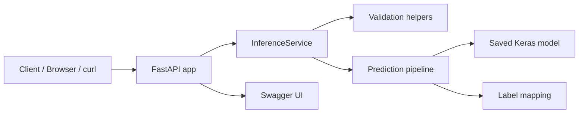

# Architecture

The application is organized around a lightweight FastAPI service that loads a pre-trained Keras model and serves inference requests over HTTP.

## Component overview

## Request flow

1. A client uploads an image to `/predict`.
2. The API validates the uploaded file and filename.
3. The service passes the image bytes to the preprocessing and prediction pipeline.
4. The model returns a probability vector and the highest-probability class label.
5. The API returns a JSON payload with the label and probabilities.

## Deployment notes

- The app can run directly with `uvicorn`.
- The Docker setup packages the app together with the model artifacts.
- Docker Compose exposes the API on port `8000` and performs a health check against `/health`.
